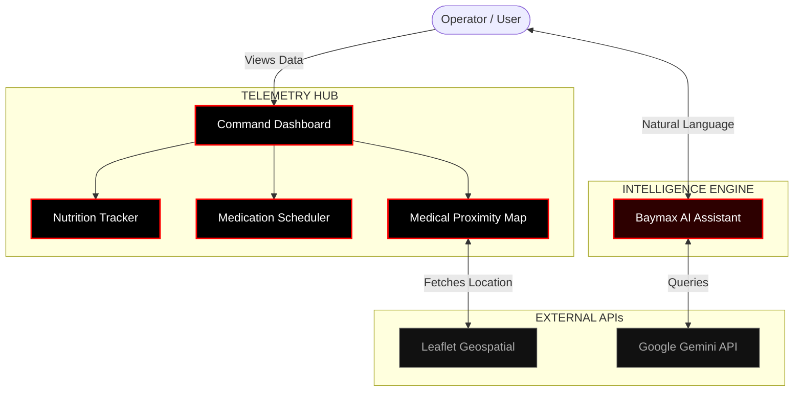

<div align="center">
  
  
  

  <br />
  <br />

  <h1><b>C A R E F L O W</b></h1>
  <p><b>[ ADVANCED HEALTH TELEMETRY & MANAGEMENT ]</b></p>
  <br />
  <p>
    <b>A unified, high-performance dashboard for your personal health.</b><br>
    CareFlow combines precise metric tracking, interactive geospatial mapping, and an integrated Baymax AI assistant into a single, distraction-free command center.
  </p>
  <hr style="border: 1px solid #ff0000; width: 50%;" />
</div>

<br />

### ❖ WHAT IS CAREFLOW?

Most health applications are cluttered with unnecessary gamification and confusing navigation. **CareFlow takes a radically different approach.** 

Designed with an ultra-minimalist, dark-themed interface, CareFlow is built for users who want total control and visibility over their well-being. It acts as a comprehensive daily hub where you can log your diet, monitor hydration, manage medication schedules, and instantly locate critical care facilities. By stripping away visual noise, CareFlow ensures your most important health data is always front and center, completely readable at a glance.

<br />

### ❖ SYSTEM ARCHITECTURE & DATA FLOW

The following flowchart illustrates the data interaction between the user, the core telemetry modules, and external intelligence APIs.



<br />

### ❖ CORE FEATURES & CAPABILITIES

<details open>
<summary><b>1. THE COMMAND DASHBOARD</b></summary>
<br>
<blockquote>
  <b>Your Daily Health at a Glance.</b><br> 
  The central hub aggregates all your live data. You can instantly see your BMI trends, daily caloric intake, and upcoming medication doses in one high-contrast, unified view. It's designed to give you a complete picture of your health the moment you open the app.
</blockquote>
</details>

<details open>
<summary><b>2. NUTRITION & HYDRATION TRACKER</b></summary>
<br>
<blockquote>
  <b>Precision Dietary Monitoring.</b><br>
  Log your meals and fluid intake with zero friction. The interface replaces confusing charts with bold, highly legible progress indicators, making it incredibly easy to see exactly where you stand against your daily health targets.
</blockquote>
</details>

<details open>
<summary><b>3. MEDICAL PROXIMITY MAP</b></summary>
<br>
<blockquote>
  <b>Critical Logistics & Emergency Routing.</b><br> 
  Equipped with a live interactive map, CareFlow can instantly locate nearby hospitals, clinics, and pharmacies based on your current location. In an emergency, or when traveling, you have immediate access to critical care routing.
</blockquote>
</details>

<details open>
<summary><b>4. AI HEALTH ASSISTANT</b></summary>
<br>
<blockquote>
  <b>Powered by Baymax (Gemini Engine).</b><br>
  We've integrated a powerful natural language AI directly into the dashboard. You can ask complex health queries, get advice on nutrition, or ask for help navigating the app, all without ever leaving your telemetry feed.
</blockquote>
</details>

<br />

### ❖ TECHNICAL STACK

CareFlow is built on a modern, high-speed technology stack to ensure zero-latency interactions and reliable data management.

| TECHNOLOGY | PURPOSE & IMPLEMENTATION |
| :--- | :--- |
| **React 19 & Vite** | Powers the core user interface, ensuring lightning-fast load times and a highly responsive frontend experience. |
| **TailwindCSS** | Drives the uncompromising, pure-black design system, utilizing custom utility classes for absolute visual consistency. |
| **Google Gemini API** | The backend intelligence engine powering the Baymax AI assistant, allowing users to interact with a conversational AI for health insights. |
| **Leaflet & React-Leaflet** | Renders the high-performance, interactive geospatial map used for locating medical facilities. |
| **Framer Motion & GSAP** | Handles the fluid, micro-animations and seamless page transitions to make the application feel alive and engineered. |

<br />

### ❖ LAUNCH PROTOCOL (LOCAL SETUP)

> [!WARNING]  
> **SYSTEM PRE-FLIGHT CHECK**  
> Ensure your local machine has **Node.js (v18 or higher)** installed before attempting to run the application.

<br>

**[STEP 1] : CLONE THE REPOSITORY**  
Download the source code to your local machine.
```bash
git clone https://github.com/4-thkind/Careflow.git
cd Careflow
```

**[STEP 2] : INSTALL DEPENDENCIES**  
Install all required packages, including the rendering engines and geospatial tools.
```bash
npm install
```

**[STEP 3] : CONFIGURE AI UPLINK**  
To enable the Baymax AI assistant, create a `.env.local` file in the root directory and add your API key:
```env
GEMINI_API_KEY=your_actual_api_key_here
```

**[STEP 4] : INITIATE LOCAL SERVER**  
Start the development environment. The interface will compile and launch in your browser.
```bash
npm run dev
```

<br />

<div align="center">
  <p><i>The application is now running on your local port.</i></p>
  <p><b>PRESS <kbd>CTRL</kbd> + <kbd>C</kbd> TO STOP THE SERVER</b></p>
</div>
